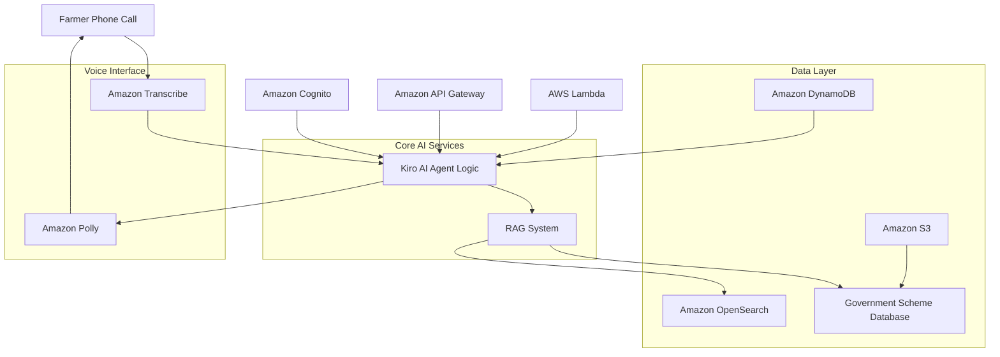

# Design Document: Krishi Sahaayak

## Overview

Krishi Sahaayak is a voice-first AI assistant system designed to bridge the information gap between Indian farmers and government agricultural schemes. The system leverages AWS AI services to provide natural language conversations in regional languages, backed by RAG (Retrieval-Augmented Generation) for accurate, government-verified information delivery.

The architecture follows a serverless, event-driven design using AWS services to ensure scalability, reliability, and cost-effectiveness while supporting the unique requirements of rural Indian farmers including low-bandwidth connectivity and voice-only interactions.

## Architecture

The system follows a microservices architecture with the following high-level components:



### Key Architectural Principles

1. **Voice-First Design**: All interactions optimized for voice input/output
2. **Serverless Architecture**: Using AWS Lambda for scalability and cost optimization
3. **RAG-Based Accuracy**: Grounding responses in verified government documents
4. **Multi-Language Support**: Native support for Indian regional languages
5. **Low-Bandwidth Optimization**: Designed for rural connectivity constraints

## Components and Interfaces

### 1. Voice Interface Layer

**Amazon Transcribe Integration**
- Converts farmer speech to text in real-time
- Supports Indian English and regional languages (Hindi, Marathi, Punjabi, Tamil)
- Handles rural accents and dialects
- Optimized for telephony audio quality

**Amazon Polly Integration**
- Converts AI responses to natural speech
- Supports regional language voices with appropriate accents
- Optimized for clear delivery over phone calls
- Configurable speech rate for farmer comprehension

### 2. AI Agent Logic (Core Intelligence)

**Kiro AI Agent with AWS Bedrock**
- Powered by Amazon Bedrock foundation models
- Implements conversational AI with context awareness
- Manages conversation flow and follow-up questions
- Integrates with RAG system for accurate information retrieval

**Intent Recognition and Context Management**
- Identifies farmer goals (subsidies, insurance, loans, MSP)
- Maintains conversation context throughout call session
- Builds farmer profile for personalized recommendations
- Handles multi-turn conversations with state persistence

### 3. RAG System (Retrieval-Augmented Generation)

**Amazon OpenSearch Vector Database**
- Stores vectorized government scheme documents
- Enables semantic search for relevant scheme information
- Supports real-time updates of scheme data
- Optimized for fast retrieval during conversations

**Document Processing Pipeline**
- Ingests government PDFs and official documents
- Extracts and chunks scheme information
- Creates embeddings using Amazon Bedrock
- Maintains document freshness and accuracy

### 4. Authentication and User Management

**Amazon Cognito Integration**
- Phone number-based user identification
- OTP verification for new users
- Secure session management
- User preference storage (language, previous interactions)

**User Profile Management**
- Stores farmer context and interaction history
- Manages language preferences
- Tracks scheme application status
- Maintains privacy and data security

### 5. Data Storage Layer

**Amazon DynamoDB**
- User profiles and session data
- Conversation history and context
- Scheme application tracking
- Real-time read/write operations

**Amazon S3**
- Government document storage
- Audio file storage for training
- Backup and archival data
- Static web assets for admin portal

### 6. Backend Services

**AWS Lambda Functions**
- Conversation orchestration
- RAG query processing
- User authentication logic
- Scheme eligibility calculation
- Integration with external APIs

**Amazon API Gateway**
- RESTful API endpoints
- Request routing and throttling
- Authentication and authorization
- Integration with Lambda functions

## Data Models

### User Profile Model
```json
{
  "userId": "string",
  "phoneNumber": "string",
  "preferredLanguage": "string",
  "location": {
    "state": "string",
    "district": "string"
  },
  "farmerProfile": {
    "landSize": "number",
    "cropTypes": ["string"],
    "farmingType": "string"
  },
  "interactionHistory": [
    {
      "timestamp": "datetime",
      "query": "string",
      "schemes": ["string"]
    }
  ],
  "createdAt": "datetime",
  "lastActive": "datetime"
}
```

### Conversation Session Model
```json
{
  "sessionId": "string",
  "userId": "string",
  "startTime": "datetime",
  "endTime": "datetime",
  "language": "string",
  "conversationContext": {
    "currentIntent": "string",
    "gatheredInfo": "object",
    "followUpQuestions": ["string"]
  },
  "messages": [
    {
      "timestamp": "datetime",
      "speaker": "user|assistant",
      "content": "string",
      "audioUrl": "string"
    }
  ]
}
```

### Government Scheme Model
```json
{
  "schemeId": "string",
  "schemeName": "string",
  "description": "string",
  "eligibilityCriteria": {
    "landSize": "object",
    "income": "object",
    "cropType": ["string"],
    "location": ["string"]
  },
  "benefits": {
    "subsidyAmount": "number",
    "subsidyPercentage": "number",
    "description": "string"
  },
  "applicationProcess": {
    "steps": ["string"],
    "requiredDocuments": ["string"],
    "applicationUrl": "string"
  },
  "lastUpdated": "datetime",
  "sourceDocument": "string"
}
```

## Error Handling

### Voice Processing Errors
- **Speech Recognition Failures**: Implement retry mechanisms with clarification prompts
- **Audio Quality Issues**: Request farmer to repeat or speak more clearly
- **Language Detection Errors**: Provide language selection options

### RAG System Errors
- **No Relevant Schemes Found**: Provide general guidance and suggest follow-up questions
- **Outdated Information**: Implement document freshness checks and update notifications
- **Retrieval Failures**: Fallback to cached responses and escalation to human agents

### System Integration Errors
- **AWS Service Outages**: Implement circuit breakers and graceful degradation
- **Database Connection Issues**: Use connection pooling and retry logic
- **Authentication Failures**: Clear error messages and alternative verification methods

### User Experience Errors
- **Long Response Times**: Implement streaming responses and progress indicators
- **Context Loss**: Session recovery mechanisms and conversation summarization
- **Misunderstood Queries**: Clarification prompts and query reformulation assistance

## Testing Strategy

The testing approach combines traditional unit testing with property-based testing to ensure system reliability and correctness across diverse farmer interactions and scenarios.

### Unit Testing Approach
- **Voice Interface Testing**: Mock audio inputs and verify transcription accuracy
- **RAG System Testing**: Test retrieval accuracy with known scheme queries
- **Authentication Testing**: Verify OTP generation and user verification flows
- **Integration Testing**: End-to-end conversation flow testing

### Property-Based Testing Approach
- **Conversation Properties**: Universal behaviors that should hold across all farmer interactions
- **Data Integrity Properties**: Ensuring consistent data handling across all operations
- **Voice Processing Properties**: Consistent behavior across different languages and accents
- **Security Properties**: Authentication and authorization correctness across all scenarios

**Testing Framework**: Jest for unit tests, fast-check for property-based testing
**Test Configuration**: Minimum 100 iterations per property test to ensure comprehensive coverage
**Test Environment**: AWS LocalStack for local development and testing

## Correctness Properties

*A property is a characteristic or behavior that should hold true across all valid executions of a system—essentially, a formal statement about what the system should do. Properties serve as the bridge between human-readable specifications and machine-verifiable correctness guarantees.*

### Property 1: Voice Interface Language Consistency
*For any* conversation session and detected language, all voice input processing and output generation should maintain the same language throughout the session, ensuring farmers receive responses in their preferred language.
**Validates: Requirements 1.2, 1.4, 6.2**

### Property 2: Voice-Only Interaction Completeness
*For any* system functionality, it should be accessible through voice commands alone without requiring text input, smartphone usage, or visual interfaces.
**Validates: Requirements 1.3**

### Property 3: RAG Response Grounding
*For any* generated response about government schemes, the information should be traceable to verified government documents and contain no hallucinated or unsourced claims.
**Validates: Requirements 2.1, 2.3, 5.1, 5.5**

### Property 4: Scheme Information Completeness
*For any* scheme information request, the response should include eligibility criteria, benefits, application steps, and required documentation when available in the source documents.
**Validates: Requirements 2.2, 5.3**

### Property 5: Contextual Prioritization Consistency
*For any* farmer profile and set of relevant schemes, the prioritization should be consistent and based on the farmer's specific context including location, crop type, and stated goals.
**Validates: Requirements 2.4**

### Property 6: Intelligent Follow-up Generation
*For any* farmer query or provided information, follow-up questions should be contextually relevant and help gather information needed for accurate scheme recommendations.
**Validates: Requirements 3.1, 3.4**

### Property 7: Goal Recognition Accuracy
*For any* farmer statement about their needs, the system should correctly identify their goals related to subsidies, insurance, MSP, loans, or other agricultural benefits.
**Validates: Requirements 3.2**

### Property 8: Conversation Context Persistence
*For any* multi-turn conversation within a session, context and previously gathered information should be maintained and referenced appropriately throughout the interaction.
**Validates: Requirements 3.3, 8.1**

### Property 9: Personalized Recommendation Relevance
*For any* farmer profile with gathered information, scheme recommendations should be tailored to their specific situation including land size, crop type, location, and stated needs.
**Validates: Requirements 3.5**

### Property 10: Phone-Based Authentication Accuracy
*For any* phone number used to access the system, user identification should be accurate and OTP verification should be required for first-time users.
**Validates: Requirements 4.1, 4.2**

### Property 11: User Data Persistence and Retrieval
*For any* user preferences, interaction history, and profile information, data should be stored securely and retrieved accurately for returning users across sessions.
**Validates: Requirements 4.3, 4.4, 8.3, 8.4**

### Property 12: Eligibility Determination Accuracy
*For any* farmer profile and scheme combination, eligibility determination should be accurate based on the scheme's official criteria and the farmer's provided information.
**Validates: Requirements 5.4**

### Property 13: Data Freshness Maintenance
*For any* government scheme information, updates to official documents should be reflected in the system database within a reasonable time period.
**Validates: Requirements 5.2**

### Property 14: Language Switching Seamlessness
*For any* language change request during a conversation, the system should transition smoothly to the new language while maintaining conversation context.
**Validates: Requirements 6.4**

### Property 15: Audio Quality Error Handling
*For any* degraded audio input or unclear speech, the system should request clarification rather than making assumptions about the farmer's intent.
**Validates: Requirements 7.4**

### Property 16: Session Recovery After Disconnection
*For any* call disconnection, session state should be preserved for a reasonable time period and recoverable when the farmer calls back.
**Validates: Requirements 8.2**

### Property 17: Privacy Data Cleanup
*For any* sensitive session data, it should be automatically cleared after appropriate time periods to maintain farmer privacy and comply with data protection requirements.
**Validates: Requirements 8.5**

### Testing Strategy

**Dual Testing Approach**:
The system requires both unit tests and property-based tests for comprehensive coverage:

- **Unit tests**: Verify specific examples, edge cases, and integration points between AWS services
- **Property tests**: Verify universal properties across all farmer interactions and system behaviors

**Unit Testing Focus**:
- AWS service integration points (Transcribe, Polly, Bedrock, OpenSearch)
- Authentication flows and OTP generation
- RAG system document retrieval and ranking
- Specific scheme eligibility calculations
- Error handling for service failures

**Property-Based Testing Focus**:
- Conversation flow properties across different farmer profiles
- Language consistency across all supported regional languages  
- Information accuracy across all government schemes
- Context management across various conversation patterns
- Security properties across all user interactions

**Property Test Configuration**:
- Framework: Jest with fast-check for property-based testing
- Minimum 100 iterations per property test due to randomization
- Each property test tagged with: **Feature: krishi-sahaayak, Property {number}: {property_text}**
- Test data generators for farmer profiles, scheme databases, and conversation scenarios

**Integration Testing**:
- End-to-end conversation flows using AWS LocalStack
- Multi-language conversation testing with synthetic audio
- RAG system accuracy testing with curated government documents
- Performance testing under simulated rural network conditions